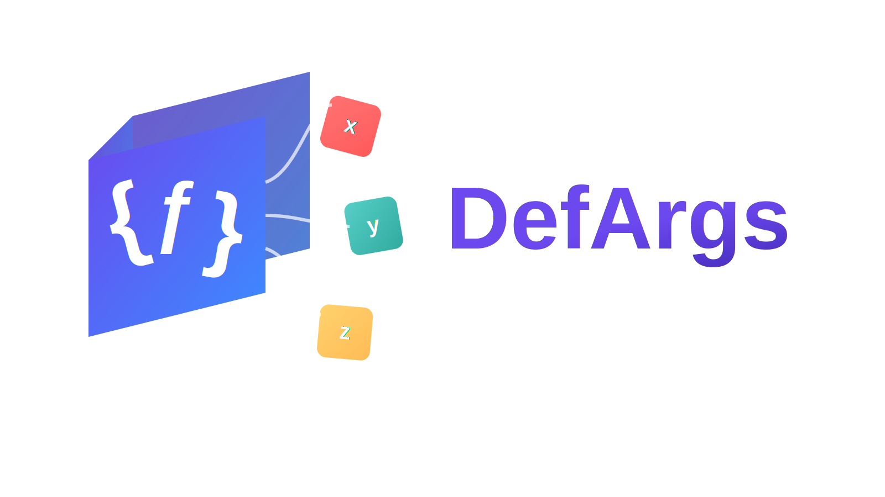

# DefArgs

[](https://central.sonatype.com/artifact/io.github.thirty30ww/defargs)
[](https://opensource.org/licenses/MIT)

一个 Java 注解处理器，通过 `@DefaultValue` 和 `@Omittable` 注解为方法参数提供默认值支持和重载方法生成。

## 快速开始

在 Maven 项目中添加依赖（[查看最新版本](https://central.sonatype.com/artifact/io.github.thirty30ww/defargs)）：

```xml
<dependency>
    <groupId>io.github.thirty30ww</groupId>
    <artifactId>defargs</artifactId>
    <version>LATEST</version> <!-- 请替换为上方链接或者徽章显示的最新版本 -->
</dependency>
```

## 使用方法

### 具体类使用 `@DefaultValue`

为具体类的方法参数添加 `@DefaultValue` 注解，编译器会自动生成带默认值的重载方法。

```java
public class UserService {
    public void createUser(
        String name,
        @DefaultValue("18") int age,
        @DefaultValue("true") boolean active
    ) {
        // 实现逻辑
    }
}
```

编译后自动生成：

```java
// 生成的重载方法 1
public void createUser(String name, int age) {
    createUser(name, age, true);
}

// 生成的重载方法 2  
public void createUser(String name) {
    createUser(name, 18, true);
}
```

现在你可以用更简洁的方式调用：

```java
service.createUser("Alice");              // 使用全部默认值
service.createUser("Bob", 25);            // 部分使用默认值
service.createUser("Charlie", 30, false); // 不使用默认值
```

### 接口和抽象类使用 `@Omittable`

对于接口或抽象类的抽象方法，使用 `@Omittable` 注解标记可省略的参数。编译器会生成对应的抽象重载方法。

```java
public interface UserRepository {
    User findUser(
        String name,
        @Omittable int age,
        @Omittable boolean active
    );
}
```

编译后自动生成抽象重载方法：

```java
// 生成的抽象重载方法 1
User findUser(String name, int age);

// 生成的抽象重载方法 2
User findUser(String name);
```

在实现类中，使用 `@DefaultValue` 提供具体的默认值：

```java
public class UserRepositoryImpl implements UserRepository {
    @Override
    public User findUser(
        String name,
        @DefaultValue("18") int age,
        @DefaultValue("true") boolean active
    ) {
        // 实现逻辑
        return new User(name, age, active);
    }
    // 编译器会自动为实现类生成带默认值的重载方法
}
```

## 工作原理

> DefArgs 在编译时通过 Java 注解处理器生成重载方法，不依赖反射，对运行时性能零影响。

注解处理器会扫描所有带 `@DefaultValue` 或 `@Omittable` 注解的方法参数，并在编译时直接修改 AST（抽象语法树），将生成的重载方法添加到同一个类或接口中。这意味着生成的代码与手写代码完全相同，没有任何性能开销。

## 注意事项

### 1. 注解使用规则

- **`@DefaultValue`**：只能用于具体方法（有方法体的方法）
- **`@Omittable`**：只能用于抽象方法（接口或抽象类的抽象方法）
- 同一个参数不能同时使用两个注解

```java
// 正确：具体方法使用 @DefaultValue
public void method(int a, @DefaultValue("1") int b) { }

// 正确：抽象方法使用 @Omittable
abstract void method(int a, @Omittable int b);

// 错误：抽象方法不能使用 @DefaultValue
abstract void method(int a, @DefaultValue("1") int b);

// 错误：具体方法不能使用 @Omittable
public void method(int a, @Omittable int b) { }
```

### 2. 可省略参数必须从右向左连续

```java
// 支持
void method(int a, @DefaultValue("1") int b, @DefaultValue("2") int c)

// 不支持
void method(@DefaultValue("1") int a, int b, @DefaultValue("2") int c)
```

### 3. 不要手动定义冲突的重载方法

如果手动定义了与生成方法签名相同的重载方法，编译时会报错：

```java
public int test(int a, @DefaultValue("2") int b) {
    return a + b;
}

public int test(int a) {  // 编译错误：此方法会自动生成
    return a + 1;
}
```

编译错误信息：
```
【DefaultValue】 已在类 com.example.MyClass 中定义了方法 test(int)
```

### 4. 支持的类型
`@DefaultValue` 注解目前支持以下类型的默认值：

- **基本类型**：`byte`、`short`、`int`、`long`、`float`、`double`、`boolean`、`char`
- **包装类型**：`Byte`、`Short`、`Integer`、`Long`、`Float`、`Double`、`Boolean`、`Character`
- **字符串类型**：`String`

> 注意：默认值必须是字符串字面量，编译器会自动转换为对应类型的值。 

`@Omittable` 可以用于任何类型的参数，包括基本类型、包装类型和字符串类型。

## IntelliJ IDEA 支持

如果你使用 IntelliJ IDEA，建议安装配套的 [defargs-intellij-plugin](https://github.com/thirty30ww/defargs-intellij-plugin) ，以获得更好的开发体验。插件会让 IDEA 识别这些生成的重载方法，消除错误提示并提供代码补全。

## 构建项目

```bash
mvnw clean install
```

## 协议

MIT License

